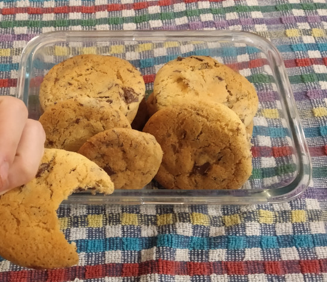
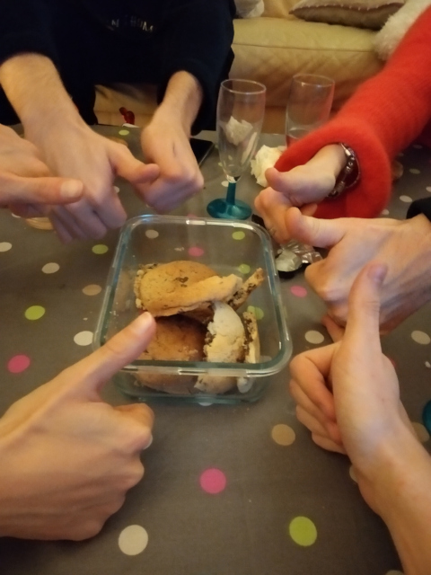

# One-hand c00kies
### by team 0x90r00t

```python
from supermarket import products as p # TODO: use localProducts instead
from superiorMeasuringUnits import GRAM as g, CELSIUS as C
from cookLib import Oven, Bowl, HumanHand, Spoon
import time
#from fun import crazyFun # not yet implemented
from fun import slightFun # not yet implemented

# Constant variables
THERMOSTAT = 180 * C
COOKING_TIME = 60 * 15 # Experimental baking time
BOWL_SIZE = Bowl.LARGE_ENOUGH
SPOON_TYPE = Spoon.WOODEN
CHOCOLATE_TYPE = p.Chocolate.DARK

# Initialize kitchen
oven = Oven()
bowl = Bowl(BOWL_SIZE)
spoon = Spoon(SPOON_TYPE)
hand = HumanHand() # TODO: handle multiple HumanHand for multithreaded optimization
cookLib.preHeatOven(oven, THERMOSTAT) # Fixes bug #488 where baking time could vary

# Prepare chocolate for later
chocolate = p.Chocolate(CHOCOLATE_TYPE)
chocolate.obliterate()
# Mix ingredients together
bowl.add(p.BUTTER, 75 * g)
bowl.add(p.WHITE_SUGAR, 85 * g)
bowl.add(p.EGG, p.EGG_WEIGHT)
bowl.add(p.VANILLA_FLAVOURED_SUGAR), 7.5 * g)
bowl.mix(spoon) # TODO: add speed limit to fix overflow bug #112
bowl.add(p.FLOOR, 150 * g)
bowl.add(p.BAKING_POWDER, 7.5 * g)
bowl.mix(hand)
bowl.add(chocolate)
bowl.mix(hand)

# Split into little cookies
cookies = bowl.pop()
for i in range(5):
    cookies = hand.split(cookies)
# Bake
oven.bake(cookies, BAKING_TIME) 
time.sleep(BAKING_TIME)

# TODO: use oven callback instead of loop
while not cookLib.isPerfectlyCooked(cookie):
    cookie.bake(30)
    time.sleep(30)

cookies = oven.removeAll()
oven.stop()

cookies.screenshot("./cookies_0x90r00t.jpg")
cookies.hideFromCat()
cookies.saveForFriends()
```

The making of: https://www.youtube.com/watch?v=EV5sNmleb7g



