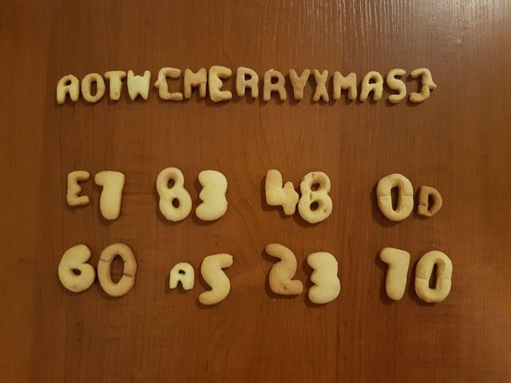
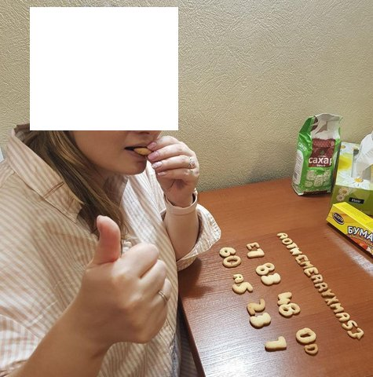
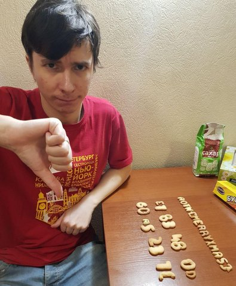

# Stack Cookie
### by team Dfyz

```C
#include "kitchen.h"

#include <chrono>
#include <memory>
#include <stdexcept>
#include <thread>

#include <sys/random.h>

int main() {
  auto bowl = std::make_unique<Bowl>();

  bowl->add(Ingredient::Egg, 3, Units::Pieces);
  bowl->add(Ingredient::Sugar, 1, Units::Cup);
  bowl->mixWithFork();

  bowl->add(Ingredient::Butter, 200, Units::Grams);
  bowl->mixWithMixer();

  bowl->add(Ingredient::BakingPowder, 0.5f, Units::Teaspoon);
  for (size_t cup = 0; cup < 3; ++cup) {
    bowl->add(Ingredient::Flour, 1, Units::Cup);
    bowl->stir();
  }

  auto refrigerator = std::make_unique<Refrigerator>(std::move(bowl));
  std::this_thread::sleep_for(std::chrono::minutes(20));

  constexpr size_t COOKIE_BYTES = 8;
  char cookie[COOKIE_BYTES] = {};
  if (getrandom(cookie, COOKIE_BYTES, 0) != COOKIE_BYTES) {
    throw std::logic_error("uh oh");
  }

  auto dough = std::make_unique<Dough>(std::move(refigerator));
  dough->makeBallShaped();
  dough->rollOut();
  auto tray = std::make_unique<Tray>();
  for (size_t i = 0; i < COOKIE_BYTES; ++i) {
    tray->add(dough->cut(cookie[i]));
  }

  auto oven = std::make_unique<Oven>(200, Units::Celsius);
  oven->add(std::move(tray));

  std::this_thread::sleep_for(std::chrono::minutes(25));
  auto bakedCookie = std::move(oven);

  return bakedCookie->status;
}
```

The making of: https://www.youtube.com/watch?v=bVxkHdzMrHw

Place the cookie on your stack to protect sensitive data (such as flags):


Here's a picture of an anonymous attacker trying to tamper with the cookie:


In this example, you can detect the attack by noticing that `70 != 7C`:

