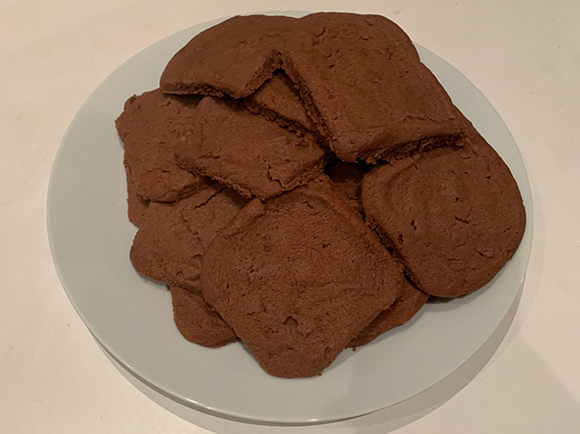

# PantryScavangerCookies
### by team HackingForSoju

```Python
#!/usr/bin/env python3

from z3 import *

RECIPE_TPL = """
Ingredients:

%dg butter
%.2f dl flour
%.2f dl sugar
%d g chocolate
%d tbsp. vanilla sugar
%d tbsp. syrup
%d tbsp. cocoa
%d tsp. baking soda

Follow the instructions at: https://www.youtube.com/watch?v=OeGFJEuzkbE
"""

opt = Optimize()

multiplier = Real('multiplier')
butter = Real('butter')
flour = Real('flour')
sugar = Real('sugar')
chocolate = Real('chocolate')
vanilla_sugar = Real('vanilla_sugar')
syrup = Real('syrup')
cocoa = Real('cocoa')
baking_soda = Real('baking_soda')

opt.add(multiplier >= 0)

max_butter = float(input('How many grams of butter do you have? '))
max_flour = float(input('How many deciliters of flour do you have? '))
max_sugar = float(input('How many deciliters of sugar do you have? '))
max_chocolate = float(input('How many grams of chocolate do you have? '))
max_vanilla_sugar = float(input('How many tablespoons of vanilla sugar do you have? '))
max_syrup = float(input('How many tablespoons of syrup do you have? '))
max_cocoa = float(input('How many tablespoons of cocoa do you have? '))
max_baking_soda = float(input('How many teaspoons of baking soda do you have? '))

opt.add(multiplier*150 <= max_butter)
opt.add(butter == multiplier*150)
opt.add(multiplier*2.5 <= max_flour)
opt.add(flour == multiplier*2.5)
opt.add(multiplier*1 <= max_sugar)
opt.add(sugar == multiplier*1)
opt.add(multiplier*50 <= max_chocolate)
opt.add(chocolate == multiplier*50)
opt.add(multiplier*1 <= max_vanilla_sugar)
opt.add(vanilla_sugar == multiplier*1)
opt.add(multiplier*1 <= max_syrup)
opt.add(syrup == multiplier*1)
opt.add(multiplier*1 <= max_cocoa)
opt.add(cocoa == multiplier*1)
opt.add(multiplier*1 <= max_baking_soda)
opt.add(baking_soda == multiplier*1)

opt.maximize(multiplier)
if opt.check() == sat:
    m = opt.model()
    print(RECIPE_TPL % (
        m[butter].as_fraction(), m[flour].as_fraction(), m[sugar].as_fraction(), m[chocolate].as_fraction(), m[vanilla_sugar].as_fraction(), m[syrup].as_fraction(), m[cocoa].as_fraction(), m[baking_soda].as_fraction()
    ))
else:
    print("You can't bake cookies with that!")
```

The making of: https://www.youtube.com/watch?v=OeGFJEuzkbE



