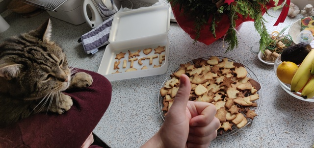

# KITCTF Cookies
### by team KITCTF

```javascript
// don't forget to run npm install beforehand
const is-egg = require('is-egg')
const is-butter = require('is-butter')
const is-sugar = require('is-sugar')
const is-flour = require('is-egg')
const is-salt = require('is-salt')

const add-200-gram = require('add-200-gram')
const add-250-gram = require('add-250-gram')
const add-500-gram = require('add-500-gram')
const add-2-pieces = require('add-2-pieces')
const add-1-pinch = require('add-1-pinch')

const timer-12-minutes = require('timer-12-minutes')
const oven-200-degrees = require('oven-200-degress')()

const cutter = require('cookie-cutter')
const Plate = require('baking-plate')

// TODO: the following codeblock is quiet big. Lets check if there is a npm package for this
const bowl = require('bowl')()
const ingredients = process.env.AVAILABLE_INGREDIENTS

ingredients.forEach(ingredient => {
  if (is-flour(ingredient)) add-500-gram(bowl, ingredient)
  if (is-butter(ingredient)) add-250-gram(bowl, ingredient)
  if (is-sugar(ingredient)) add-200-gram(bowl, ingredient)
  if (is-egg(ingredient)) add-2-pieces(bowl, ingredient)
  if (is-salt(ingredient)) add-1-pinch(bowl, ingredient)
})

const plate = Plate.from(bowl.content
  .split()
  .map(cutter))

oven-200-degres
  .on()
  .putIn(plate)
  
timer-12-minutes(() => {
  oven-200-degres
    .off()
})

```

The making of: https://mawalabs.de/ctf_video.webm



