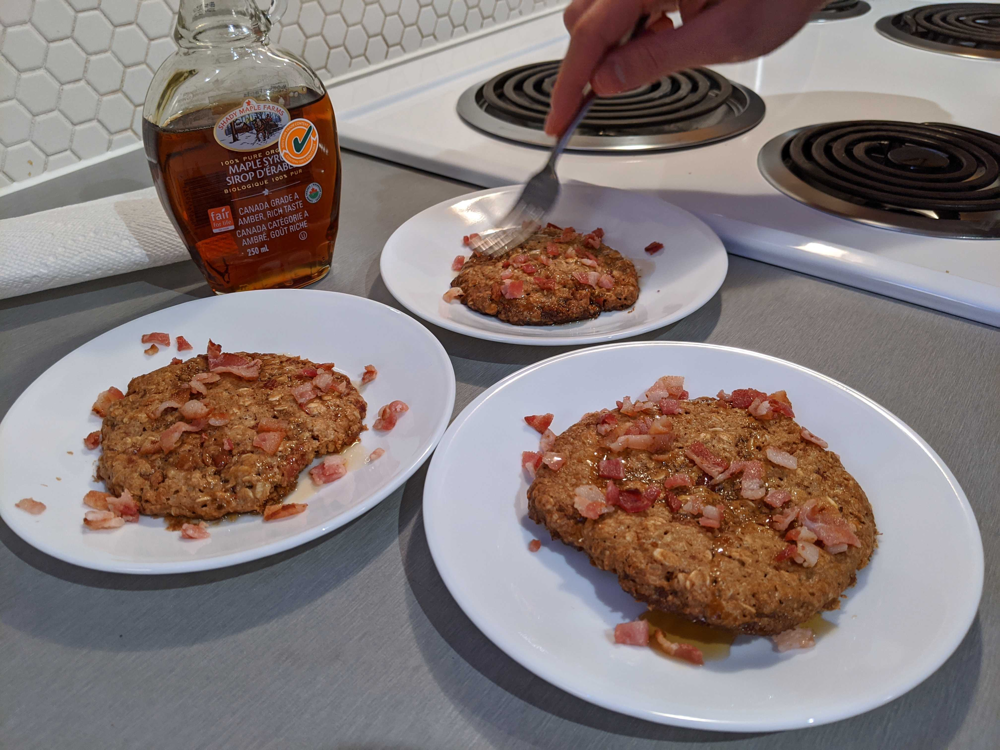
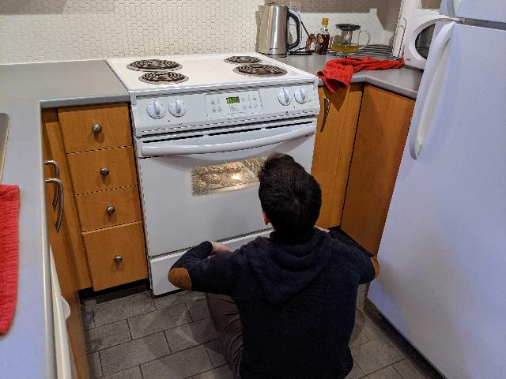

# <Maple Bacon Cookie>
### by team Maple Bacon

``` Turing
import PreMadeMix in "supermarket.t"
import MapleSyrup, OliveOil in "pantry.t"
import Meat, Eggs, UnsaltedButter in "fride.t"
import Bowl, Oven, Stove, FryingPan, BakingSheet in "kitchen.t"
import Hands, Mouth in "human.t"
import Recipe in "ctf.t"
import Time
import Draw
import View

% made in Canada
View.Set ("graphics")
Draw.MapleLeaf (0, 0, 100, 100, red)


var batch := Recipe.Start ()
% Figure out what to do because we don't have a recipe
Time.Delay (10 * 60 * 1000) % 10 minutes

var base := cheat (Homemade, PreMadeMix) % don't judge

Oven.Preheat (350)

var temperature : string = "medium"
Stove.StartStoveTop (temperature)

var numTbsp : int = 2
for i : 1 .. numTbsp
    FryingPan.Contents += OliveOil.Measure ()

for i : 1 .. 5
    FryingPan.Contents += Bacon.Slice ()
Time.Delay (5 * 60 * 1000)

FryingPan.Clear (Bacon)

var baconBits := flexible array 1 .. * of Bacon
baconBits = Bacon.Chop (size="small bits")

var measuredButter := UnsaltedButter.Measure ("1/3", "cup")
Bowl += measuredButter

var power : string = "low"
Microwave.Start (power)
Time.Delay (30 * 1000)

Microwave.Clear (Bowl)

var crackedEgg := Egg.crack ()
Bowl.Contents += crackedEgg
Bowl.Mix ()

get : amountGoodness % as much as you want
var measuredSyrup := MapleSyrup.Measure (amountGoodness)
Bowl.Contents += measuredSyrup

Bowl.Contents += PreMadeMix
Bowl.Mix ()

CookieMix := Bowl.Contents

for clump : 1 .. 8 in CookieMix
    Hands.Contents += clump
    Hands.Format ( clump, circle)
    BakingSheet += clump

Oven.Contents += BakingSheet

Time.Delay (25 * 60 * 1000) % 25 minutes

Oven.Clear ( BakingSheet )

assert Cookie.Baked()

Time.Delay (4 * 60 * 1000) % cool down

Cookies = BakingSheet.Contents

Mouth.Bite(Cookies)

% Enjoy!
```

The making of: https://www.youtube.com/watch?v=oHg5SJYRHA0
(we needed a video?)




Bonus pic: Watching cookies bake...


