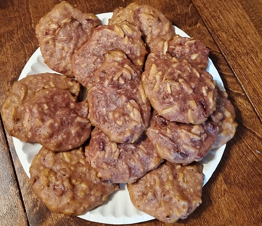

# Thanksgiving Memories
### by team OpenToAll

```powershell
function Stir-Contents($Contents) {
    $Stirred = $false
    while ($Stirred -ne $true)
    {
        Write-Host "Stirring $($Contents)"
        $Stirred = $true
    }
    return $Contents
}

function Wash-Object($Object) {
    $Clean = $false
    while ($Clean -ne $true)
    {
        Write-Host "Washing $($Object)"
        $Clean = $true
    }
    return $Object
}

function Boil-Ingredients($Ingredients) {
    $Pot = @()
    foreach ($Ingredient in $Ingredients)
    {
        $Pot += $Ingredient
    }
    Stir-Contents -Contents $Pot | Out-Null

    $Temperature = 0
    while ($Temperature -lt 212)
    {
        $Temperature++
        Write-Progress -Activity "Reducing cranberries to sauce" -Status "Boiling" -PercentComplete (($Temperature * 100) / 212 )
    }
    Write-Host "Boiled Ingredients"
    return $Pot
}

function Add-Ingredients([string] $Name, [double] $Quantity, [string] $Units) {
    $Ingredients = New-Object -TypeName PSObject
    $Ingredients.PsObject.TypeNames.Add('Ingredient.Detail')
    Write-Host "Adding $($Quantity) $($Units) of $($Name)"
    Add-Member -InputObject $Ingredients -memberType NoteProperty -Name $Name -Value $Quantity
    return $Ingredients
}

function Preheat-Oven([int] $Temperature,  [string] $Units, $Oven) {    
    $Oven.Temperature = $Temperature
    $Oven.Units = $Units
    Write-Host "Setting oven temp to $($Temperature) degrees $($Units)"
}

function Apply-CookieBatterToBakingSheet($Sheet, [ref] $Batter) {
    Write-Host "Spreading batter onto baking sheet"
    $Sheet | Add-Member -MemberType NoteProperty -Name Contents -Value $Batter.Value
    $Batter.Value = $null
}

function Start-Baking([ref]$Oven, [int] $BakeMinutes) {
    For ($Seconds = (New-TimeSpan -Minutes $BakeMinutes).TotalSeconds; $Seconds -ne 0; $Seconds--)
    {
        Write-Progress -Activity "Converting Cookie Batter into Cookies" -Status "Baking" -SecondsRemaining $Seconds
        Start-Sleep -Seconds 1
    }
    $Oven.Value.Contents = "Cookies"
}

# Wash cranberries prior to use
$Cranberries = Wash-Object -Object "Cranberries"

# Combine sauce ingredients
$Sauce = @()
$Sauce += Add-Ingredients -Name $Cranberries -Quantity 1 -Units "Bag"
$Sauce += Add-Ingredients -Name "Sugar" -Quantity 1 -Units "Cup"
$Sauce += Add-Ingredients -Name "Orange Juice" -Quantity 1 -Units "Cup"
$Sauce += Add-Ingredients -Name "Butter" -Quantity 1.5 -Units "Stick"
$Sauce += Add-Ingredients -Name "Brown Sugar" -Quantity 1 -Units "Cup"

# Boil sauce ingredients
$Sauce = Boil-Ingredients -Ingredients $Sauce

# Combine cookie batter ingredients
$Batter = @()
$Batter += Add-Ingredients -Name "Flour" -Quantity 3.5 -Units "Cup"
$Batter += Add-Ingredients -Name "Baking Powder" -Quantity 1 -Units "Teaspoon"
$Batter += Add-Ingredients -Name "Vanilla Extract" -Quantity 1 -Units "Teaspoon"
$Batter += Add-Ingredients -Name "Salt" -Quantity 0.5 -Units "Teaspoon"
$Batter += Add-Ingredients -Name "Milk" -Quantity 0.34 -Units "Cup"
$Batter += Add-Ingredients -Name "Egg" -Quantity 1 -Units "Unit"
$Batter += Add-Ingredients -Name "Slivered Almonds" -Quantity 1 -Units "Bag"

# Add sauce to batter
$Batter += $Sauce

Stir-Contents -Contents $Batter | Out-Null

# Configure oven
$Oven = New-Object PSObject -Property @{
    Temperature = 0
    Units = "Fahrenheit"
}

Preheat-Oven -Temperature 350 -Units "Fahrenheit" -Oven $Oven

# Prepare product for baking
$CookieSheet = New-Object -TypeName PSObject

while ($null -ne $Batter)
{
    Apply-CookieBatterToBakingSheet -Sheet $CookieSheet -Batter ([ref] $Batter)
}

# Check to make sure oven is preheated
while ($Oven.Temperature -ne 350 -and $Oven.Units -notmatch 'Fahrenheit' )
{
    Start-Sleep -Seconds 60
}

# Put cookies into oven
$Oven | Add-Member -MemberType NoteProperty -Name Contents -Value $CookieSheet

# Bake for 24 minutes
Start-Baking -Oven ([ref]$Oven) -BakeMinutes 24

# Remove finished product from oven
$product = $Oven.Contents
$Oven.Contents = $null

# Cleanup
Wash-Object -Object "Cookie Sheet" | Out-Null
Wash-Object -Object "Oven" | Out-Null

Write-Host "$($product) ready for consumption.  `$Holidays += `$Happy!"
```

The making of: https://youtu.be/qNTMWBCgXC8



