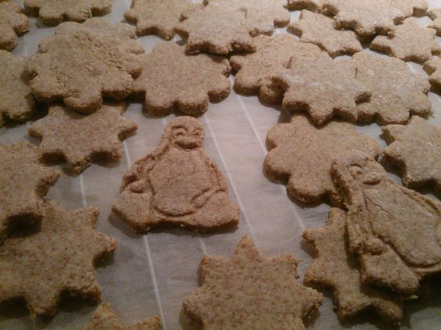
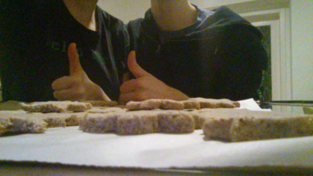

# Christmas cookies
### by team [SIGFLAG](https://www.sigflag.at)

```python
import random

from kitchen import Kitchen, Ingredient, Unit
from kitchen.utensils import Bowl, Cup
from kitchen.tasks import separate_egg


def get_ingredients() -> dict:
    return {
        "eggs": Ingredient("egg", 3, Unit.PIECE),  # TODO: we only need the egg white
        "sugar": Ingredient("sugar", 70, Unit.GRAM),
        "cinnamon": Ingredient("cinnamon", 2, Unit.TEASPOON),
        "almonds": Ingredient("almonds", 400, Unit.GRAM)
    }


def make_cookies(kitchen: Kitchen, cookie_cutters: list) -> list:
    ingridients = get_ingredients()
    
    bowl = Bowl()
    cup = Cup()
    kitchen.add(bowl)
    kitchen.add(cup)

    egg_white, yolk = separate_egg(ingridients['egg'])
    bowl.add(egg_white)
    cup.add(yolk)  # actually the cookies don't need it, but we don't want it on the floor

    while bowl.components_are_liquid():
        bowl.mix(30, Unit.SECONDS)
        
    for sugar_part in ingridients['sugar'].split(8):
        bowl.add(sugar_part)
        bowl.mix(20, Unit.SECONDS)
    while not bowl.is_homogeneous_mass():
        bowl.mix(20, Unit.SECONDS)

    bowl.add(ingridients['cinnamon'])
    bowl.stir_in(5, Unit.SECONDS)
    
    # its better to split this task
    for almonds_part in ingridients['almonds'].split(8):
        bowl.add(almonds_part)
        bowl.stir_in(30, Unit.SECONDS)
    while not bowl.is_homogeneous_mass():
        bowl.stir_in(30, Unit.SECONDS)
    
    assert not bowl.components_are_liquid()  # TODO: just be sure

    cookies = []
    
    workarea = kitchen.get_free_workarea()
    while not bowl.empty():
        workarea.put(Ingredient("flour", 1, Unit.WHATEVER_YOUR_THINK))  # This is only required to prevent the mass of sticking to the workarea
        workarea.put(bowl.get(2, Unit.HAND))  # TODO: this should be sensible enough?
        workarea.knead(5, Unit.SECONDS)
        workarea.roll_out(5, Unit.MILLIMETRE)

        cookie_cutter = random.choice(cookie_cutters)
        while workarea.enough_space(cookie_cutter):
            cookies.append(workarea.cut(cookie_cutter))
        
        bowl.put(workarea.get())  # put rest back
        
    with kitchen.get_oven(130, Unit.DEGREE_CELSIUS) as oven:
        cookies = oven.bake(cookies, 20, Unit.MINUTES)

    # TODO: really required?
    from kitchen.utensils import Pan
    pan = Pan()
    with kitchen.get_hot_plate(1,  Unit.WHATEVER_YOUR_THINK) as plate:
        plate.put(pan)
        pan.add(Ingredient("olive oil", 1, Unit.WHATEVER_YOUR_THINK))
        pan.wait_until_hot()
        pan.add(yolk)
        pan.add(Ingredient("salt", 1, Unit.WHATEVER_YOUR_THINK))
        while pan.components_are_liquid():
            pass  # sleep? What do your think!
        cooked_egg = pan.get()  # TODO: we need to do something with this ;)      
        
    return cookies


def taste_cookies(cookies: list):
    assert cookies

    from persons import Hacker
    hacker = Hacker()
    return hacker.eat(cookies[0]).response


def cleanup_kitchen(kitchen: Kitchen):
    from persons import Hacker
    hacker = Hacker()
    try
        assert hacker.likes_to_have_girlfriend()
        from persons import Girlfriend
        while kitchen.is_dirty():
            kitchen.clean([hacker, Girlfriend(hacker)])
    except ModuleNotFoundError e:
        kitchen.clean([hacker])


if __name__ == "__main__":
    kitchen = Kitchen()
    cookies = make_cookies(kitchen, ingridients)
    taste_cookies(cookies)
    cleanup_kitchen(kitchen)
```

The making of: https://streamable.com/u1pc5



