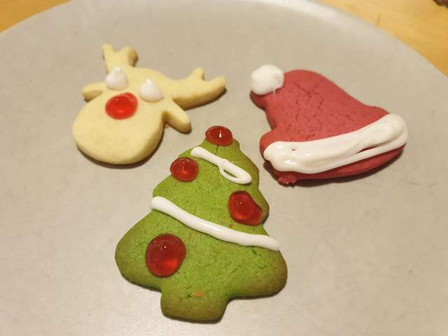
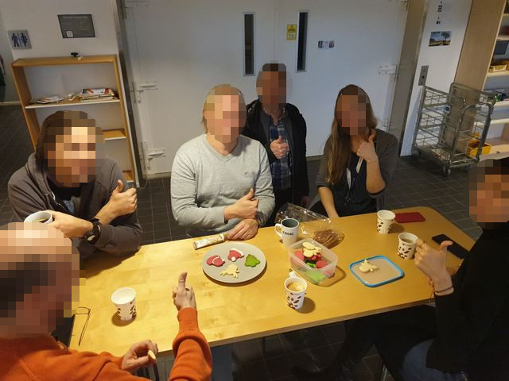

# Christmas cookies
### by team Santa

```C
#include <recipe_base.h>
#include <kitchen_utils.h>
#include <ingredients.h>

int main() {
	Oven *oven = allocate_oven();
	Bowl *bowl = allocate_bowl();
	Surface *workarea = allocate_surface();
	Bakingtray *tray = allocate_bakingtray(INCLUDE_BAKING_PAPER);

	preheat(oven, 190, CELSIUS);

	add_to_bowl(bowl, ingredient("room-temperature butter", 284, GRAM));
	add_to_bowl(bowl, ingredient("sugar", 200, GRAM));
	add_to_bowl(bowl, ingredient("egg", 1, PIECE));
	add_to_bowl(bowl, ingredient("milk", 30, MILLILITER));
	add_to_bowl(bowl, ingredient("vanilla extract", 1, TEASPOON));
	add_to_bowl(bowl, ingredient("baking powder", 2, TEASPOON));
	// add_to_bowl(bowl, ingredient("salt", 1, PINCH)); // TODO: define and implement PINCH
	mix_contents(bowl);
	add_to_bowl(bowl, ingredient("flour", 250, GRAM));
	mix_contents(bowl);
	add_to_bowl(bowl, ingredient("flour", 250, GRAM));
	mix_contents(bowl);
	// optional: add food coloring for colored cookies

	spread_on_surface(workarea, get_contents(bowl));

	while(!is_empty(workarea) && !is_full(tray)) {
		move(cut_cookie_shape(workarea), tray);
	}

	move(tray, oven);

	sleep(600);
	//sleep(120); // TODO: sometimes extra time is needed based on oven
	
	empty_into(tray, cookiejar); // careful, may be hot

	clean(bowl);
	clean(workarea);
	clean(cooldown(tray));
	clean(cooldown(oven));

	// optional: decorate cookies

	return HAPPY;
}
```

The making of: https://youtube.com/team_Santa_gets_no_points_because_they_have_no_video



