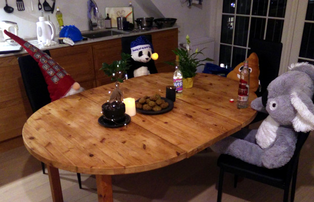
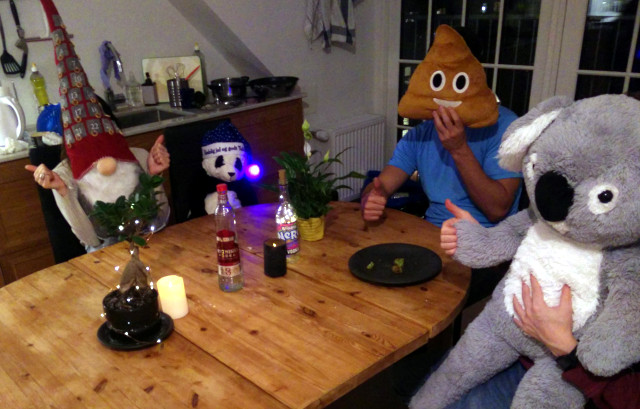

# Spotless Cookies
### by team Spotless

```D
import cooking.ingredients;
import cooking.oven;
import cooking.utils;
import cooking.units;
import cooking.cookies;
import std.algorithm;
import core.thread;

/++
  + Creates cookies.
  ++/
Cookie[] bakeCookies(Oven oven)
in {
        assert(oven.temp == 180.Celcius);
} out {
        assert (cookies.fold!((a,b) => a & isVegan(b), true));
} body {
        auto b1 = new Bowl;
        b1.add(new RolledOats, 350.cl);
        b1.add(new Flour, 240.cl);
        b1.add(new CoconutFlakes, 240.cl);
        b1.add(new BakingPowder, 1.tsp);
        b1.add(new Salt, 0.5.tsp);
        b1.add(new Cinnamon, 0.5.tsp);
        b1.mix(Bowl.MixingMethod.METHOD_SPOON);

        auto b2 = new Bowl;
        b2.add(new BrownSugar, 240.cl);
        b2.add(new Margarine, 100.cl);
        b2.mix(Bowl.MixingMethod.METHOD_MIXER);
        b2.add(new VanillaSugar, 1.tsp);
        b2.add(new MapleSyrup, 3.sp);
        b2.mix(Bowl.MixingMethod.METHOD_MIXER);

        b1.add(b2.content);

        b1.mix(Bowl.MixingMethod.METHOD_HANDS);
        b1.add(new RiceMilk, 1.sp);
        b1.mix(Bowl.MixingMethod.METHOD_HANDS);

        auto dough = b1.content;
        auto platter = o.getPlatter();
        platter.addCover(new BakingPaper);

        while (dough.mass >= 0) {
                auto x = dough.take(MASS_A_BIT);
                x.shape(SHAPE_BALL);
                platter.add(x);
        }

        o.add(platter);

        Thread.sleep(15.minutes);

        o.remove(platter);

        Cookie[] cookies;
        platter.content.each(a => cookies ~= a);
        return cookies;
}

void main()
{
        Oven o = new Oven;
        o.target_temp(453.15.Kelvin);
        o.heat();
        scope (exit) o.turnOff();
        bakeCookies(o);
}
```

The making of: [streamable.com/lpcm9](https://streamable.com/lpcm9)



