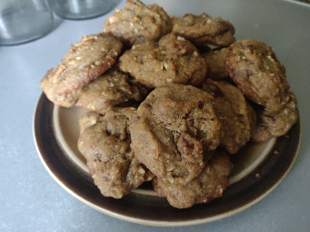
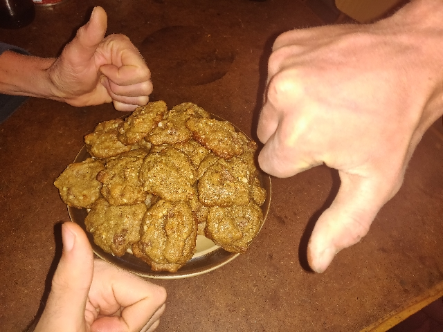

# Chocolate Bit Cookies
### by team The Order Of Bit

```
# ======================================================================== #
#                          -=- CHOC BIT COOKIES -=-                        #
#                           team: the order of bit                         #
#                                                                          #
#                    recipe coded in assemblium, see day 15                #
#              binary compiler used: https://pastebin.com/FttjyQ5h         #
#          assemblium interpreter used: https://pastebin.com/yNSKdjrW      #
#             python3 -u compileasm.py cookies.asm | ./assemblium          #
# ======================================================================== #

# === STRING UTILITIES ===

# func0: print chars until reaching null byte
21 80 60 80 11 80 30 80 00 a0

# func1: print null terminated string
21 80 60 80 40 80 01 a0

# str1: wet mixture
21 80 77 65 74 20 6d 69 78 74 75 72 65 00 1e a0

# str2: dry mixture
21 80 64 72 79 20 6d 69 78 74 75 72 65 00 1f a0

# === KITCHEN UTILITIES ===

# func2: add something to something else
21 80 30 80 0a 41 80 41 80 20 74 6f 20 00 40 80 40 80 61 64 64 69 6e 67 20 00 02 a0

# func3: remove something from something else
21 80 30 80 0a 41 80 41 80 20 66 72 6f 6d 20 00 40 80 40 80 72 65 6d 6f 76 69 6e 67 20 00 03 a0

# func4: obtain something
21 80 30 80 0a 41 80 41 80 6f 62 74 61 69 6e 69 6e 67 20 00 04 a0

# func5: mix until smooth
21 80 30 80 0a 41 80 6d 69 78 69 6e 67 20 75 6e 74 69 6c 20 73 6d 6f 6f 74 68 00 05 a0

# func6: wait for some time
21 80 30 80 0a 41 80 41 80 77 61 69 74 69 6e 67 20 66 6f 72 20 00 06 a0

# func7: clean up 
21 80 30 80 0a 41 80 63 6c 65 61 6e 69 6e 67 20 75 70 00 07 a0

# === MAIN ===

# MAKING CHOCOLATE BIT COOKIES

00 53 45 49 4b 4f 4f 43 20 54 49 42 20 43 4f 48 43 20 47 4e 49 4b 41 4d c1 0a b0

# WET MIXTURE

# obtain mixing bowl
00 6c 77 6f 62 20 67 6e 69 78 69 6d c4

# add 120g of butter to wet mixture
de 00 72 65 74 74 75 62 20 66 6f 20 67 30 32 31 c2

# add 1.5 cups of sugar to wet mixture
de 00 72 61 67 75 73 20 66 6f 20 73 70 75 63 20 35 2e 31 c2

# add 0.5 cups of brown sugar to wet mixture
de 00 72 61 67 75 73 20 6e 77 6f 72 62 20 66 6f 20 73 70 75 63 20 35 2e 30 c2

# mix until smooth
c5

# add 2 eggs to wet mixture
de 00 73 67 67 65 20 32 c2

# add 0.5 tsp of vanilla extract to wet mixture
de 00 74 63 61 72 74 78 65 20 61 6c 6c 69 6e 61 76 20 66 6f 20 70 73 74 20 35 2e 30 c2

# mix until smooth
c5

# DRY MIXTURE

# obtain mixing bowl
00 6c 77 6f 62 20 67 6e 69 78 69 6d c4

# add 2 cups of flour to dry mixture
df 00 72 75 6f 6c 66 20 66 6f 20 73 70 75 63 20 32 c2

# add 1 tsp of salt to dry mixture
df 00 74 6c 61 73 20 66 6f 20 70 73 74 20 31 c2

# add 0.5 tsp of baking soda to dry mixture
df 00 61 64 6f 73 20 67 6e 69 6b 61 62 20 66 6f 20 70 73 74 20 35 2e 30 c2

# add 0.5 tsp of cinnamon to dry mixture
df 00 6e 6f 6d 61 6e 6e 69 63 20 66 6f 20 70 73 74 20 35 2e 30 c2

# mix until smooth
c5

# COMBINING

# add 0.5 of dry mixture to wet mixture
de df 20 66 6f 20 35 2e 30 c2

# mix until smooth
c5

# add 0.5 of dry mixture to wet mixture
de df 20 66 6f 20 35 2e 30 c2

# add 1.5 cups of chocolate chips to wet mixture
de 00 73 70 69 68 63 20 65 74 61 6c 6f 63 6f 68 63 20 66 6f 20 73 70 75 63 20 35 2e 31 c2

# add 1 cup of chopped nuts to wet mixture
de 00 73 74 75 6e 20 64 65 70 70 6f 68 63 20 66 6f 20 70 75 63 20 31 c2

# add 1 tbsp of lemon zest to wet mixture
de 00 74 73 65 7a 20 6e 6f 6d 65 6c 20 66 6f 20 70 73 62 74 20 31 c2

# mix until smooth
c5

# REFRIGDERATING

# obtain fridge
00 65 67 64 69 72 66 c4

# add dough in to fridge
00 65 67 64 69 72 66 00 68 67 75 6f 64 c2

# wait 1 hour
00 72 75 6f 68 20 31 c6

# remove dough from fridge
00 65 67 64 69 72 66 00 68 67 75 6f 64 c3

# BAKING

# obtain oven preheated at 175 celcius
00 73 75 69 63 6c 65 63 20 35 37 31 20 74 61 20 64 65 74 61 65 68 65 72 70 20 6e 65 76 6f c4

# obtain baking pan
00 6e 61 70 20 67 6e 69 6b 61 62 c4

# add dough clumps on to baking pan
00 6e 61 70 20 67 6e 69 6b 61 62 00 73 70 6d 75 6c 63 20 68 67 75 6f 64 c2

# add baking pan in to oven
00 6e 65 76 6f 00 6e 61 70 20 67 6e 69 6b 61 62 c2

# wait 15 minutes
00 73 65 74 75 6e 69 6d 20 35 31 c6

# remove baking pan from oven
00 6e 65 76 6f 00 6e 61 70 20 67 6e 69 6b 61 62 c3

# CLEANUP
c7
```

The making of: https://youtu.be/v7dub9hyk-o



