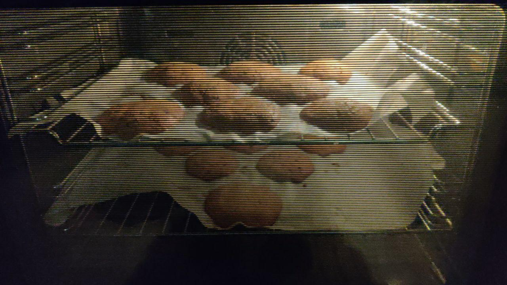
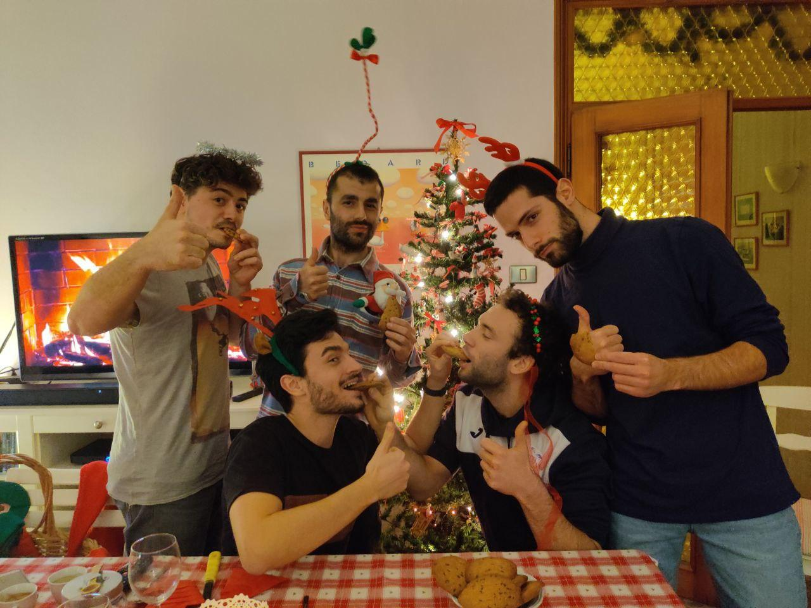

# ITALIAN CHOCOLATE COOKIES 
### by team UlisseLabBO

```Python
import ingredients from fridge as ing
import bowl,oven_tray,oven utils from kitchen
import units from metric as u
import hacker from UlisseLabBO


print("WELCOME TO ITALY")
bowl1.add(ing.BUTTER, 250 * u.GRAM)
bowl1.add(ing.BROWN_SUGAR, 100 * u.GRAM)
bowl1.add(ing.SUGAR, 100 * u.GRAM)
while not smooth_cream:
    smooth_cream=bowl1.mix(utils.WOODEN_SPOON)
bowl1.add(ing.EGG,2*u.PIECE)
bowl1.add(ing.VANILLA_EXTRACT,1*u.LITTLE_SPOON)
while not homogenous_compound:
    compound=bowl1.mix(utils.WOODEN_SPOON)
usefull_flour=u.STRAINER(ing.FLOUR,300*u.GRAM)
bowl2.add(usefull_flour)
bowl2.add(ing.BICARBONATE,5*u.GRAM)
bowl2.add(ing.SALT,1*u.PINCH)
bowl2.mix(u.WOONED_SPOON)
bowl1.add(bowl2.content)
while not solid_dense_homogenous_compound:
    compound=bowl1.mix(utils.WOODEN_SPOON)
bowl1.add(ing.CHOCOLATE_CHIP,200*u.GRAM)
bowl1.mix(u.WOONED_SPOON)

oven.preheat(160*,u.CELSIUS)


while not bowl.content:
    oven_tray.add(u.BAKING_PAPER)
    sphere=make_sphere(bowl.content,50*u.GRAM)
    oven_tray.add(sphere)
    oven_tray.check_distances_spheres() #otherwise they can melt together
    fridge.put(oven_tray.content,1*time.HOUR)
    oven_tray.add(fridge.content.biscuits)
    oven.put(oven_tray,40*time.MINUTE)

hacker.retrieve(biscuits)
print("Don't burn yourself, we know they are good, but please, wait")
hacker.wait_impatiently(3*time.MINUTE)
hacker.eat(ALL_BISCUITS)


```

The making of: https://streamable.com/659jw



