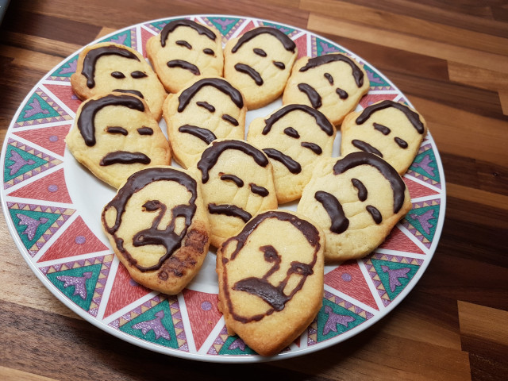
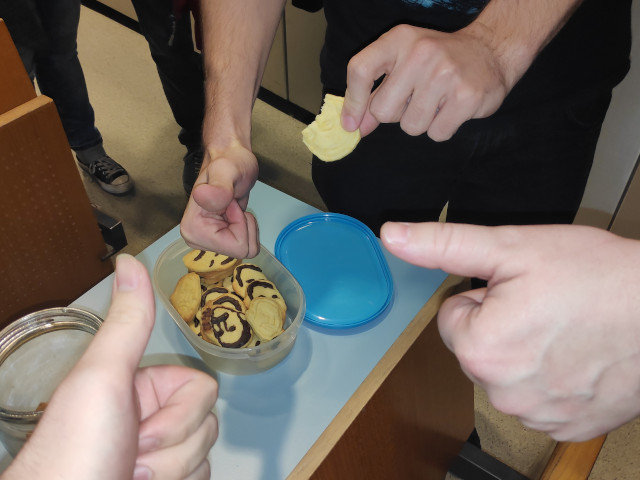

# Christmas Cookies

Cooking with theboss from We\_0wn\_Y0u.

## Making-of

Enjoy [baking with We\_0wn\_Y0u](https://youtu.be/Jrnj8xR5hrk).

## Result



## Evaluation



## Cookie VM

We only tested with this GCC Version:

```
Using built-in specs.
COLLECT_GCC=gcc
COLLECT_LTO_WRAPPER=/usr/lib/gcc/x86_64-pc-linux-gnu/9.2.0/lto-wrapper
Target: x86_64-pc-linux-gnu
Configured with: /build/gcc/src/gcc/configure --prefix=/usr --libdir=/usr/lib --libexecdir=/usr/lib --mandir=/usr/share/man --infodir=/usr/share/info --with-bugurl=https://bugs.archlinux.org/ --enable-languages=c,c++,ada,fortran,go,lto,objc,obj-c++,d --enable-shared --enable-threads=posix --with-system-zlib --with-isl --enable-__cxa_atexit --disable-libunwind-exceptions --enable-clocale=gnu --disable-libstdcxx-pch --disable-libssp --enable-gnu-unique-object --enable-linker-build-id --enable-lto --enable-plugin --enable-install-libiberty --with-linker-hash-style=gnu --enable-gnu-indirect-function --enable-multilib --disable-werror --enable-checking=release --enable-default-pie --enable-default-ssp --enable-cet=auto gdc_include_dir=/usr/include/dlang/gdc
Thread model: posix
gcc version 9.2.0 (GCC)
```

Compile the following code with `gcc -c cvm.c cvm`:

```c
#include <unistd.h>

#define OP_PUSH         0x00
#define OP_MIX          0x01 /* num_ingredients, type, amount, ... */
#define OP_COOL         0x02 /* dough, duration */
#define OP_SPLIT        0x03 /* cooled_dough, count */
#define OP_ROLL         0x04 /* cooled_dough */
#define OP_ENGRAVE      0x05 /* rolled_dough, form */
#define OP_CUT_OUT      0x06 /* rolled_dough, form */
#define OP_PLACE        0x07 /* baking_sheet, cut_out */
#define OP_BAKE         0x08 /* baking_sheet, temp, minutes */
#define OP_BAKING_SHEET 0x09
#define OP_PRINT_FORM   0x0a /* form_parameter */
#define OP_IF_ELSE      0x0b /* condition else_pc */
#define OP_DEC          0x0c
#define OP_SWAP         0x0d
#define OP_DUP          0x0e
#define OP_JMP          0x0f /* pc */
#define OP_POP          0x10
#define OP_LD           0x11 /* var_id */
#define OP_ST           0x12 /* var_id, value */
#define OP_HLT          0x13

#define DISPATCH() goto *dispatch_table[code[pc++]]

int main(int argc, char **argv) {
    unsigned char code[1000];
    unsigned long stack[100];
    unsigned long vars[10];
    unsigned long pc, sp, tmp, i, a, b;

    static void* dispatch_table[] = {
        &&do_push, &&do_mix, &&do_cool,
        &&do_split, &&do_roll, &&do_engrave,
        &&do_cut_out, &&do_place, &&do_bake,
        &&do_baking_sheet, &&do_print_form, &&do_if_else,
        &&do_dec, &&do_swap, &&do_dup, &&do_jmp,
        &&do_pop, &&do_ld, &&do_st, &&do_hlt
    };

    for (i = 0; i < 1000; i++)
        code[tmp] = OP_HLT;
    read(0, code, 1000);

    pc = 0;
    sp = 0;

    DISPATCH();
    while (1) {
    do_push:
        stack[sp++] = *((unsigned long *)&code[pc]);
        pc += 8;
        DISPATCH();
    do_mix:
        write(1, "Mixing ingredients...\n", 22);
        tmp = stack[--sp];
        for (i = 0; i < tmp; i++) {
            a = stack[--sp];
            b = stack[--sp];

            switch (a & 0xf) {
            case 0x1:
                write(1, "Adding flour...\n", 16);
                break;
            case 0x2:
                write(1, "Adding butter...\n", 17);
                break;
            case 0x3:
                write(1, "Adding sugar...\n", 16);
                break;
            case 0x4:
                write(1, "Adding vanilla sugar...\n", 24);
                break;
            case 0x5:
                write(1, "Adding yolks...\n", 16);
                break;
            default:
                write(2, "Unknown ingredient, error!\n", 27);
                _exit(1);
            }
        }

        /* Pushing dough on the stack */
        stack[sp++] = 0x0300000000000000;

        DISPATCH();
    do_cool:
        a = stack[--sp];
        b = stack[--sp];

        if ((a >> 56) != 0x3) {
            write(2, "OP_COOL: Expected dough\n", 24);
            _exit(1);
        } 

        write(1, "Cooling...\n", 11);

        /* Pushing cooled dough on the stack */
        stack[sp++] = 0x0400000000000000;
        DISPATCH();
    do_split:
        a = stack[--sp];
        b = stack[--sp];

        if ((a >> 56) != 0x4) {
            write(2, "OP_SPLIT: Expected cooled dough\n", 32);
            _exit(1);
        } 

        write(1, "Splitting dough...\n", 19);
        for (i = 0; i < b; i++) {
            stack[sp++] = 0x0400000000000000;
        }
        DISPATCH();
    do_roll:
        a = stack[--sp];

        if ((a >> 56) != 0x4) {
            write(2, "OP_ROLL: Expected cooled dough\n", 31);
            _exit(1);
        } 

        write(1, "Rolling out dough...\n", 21);

        /* Pushing cooled dough on the stack */
        stack[sp++] = 0x0500000000000000;
        DISPATCH();
    do_engrave:
        a = stack[--sp];
        b = stack[--sp];

        if ((a >> 56) != 0x5) {
            write(2, "OP_ENGRAVE: Expected rolled out dough\n", 38);
            _exit(1);
        } 

        if ((b >> 56) != 0x8) {
            write(2, "OP_ENGRAVE: Expected printed form\n", 34);
            _exit(1);
        } 

        write(1, "Engraving...\n", 13);
        DISPATCH();
    do_cut_out:
        a = stack[--sp];
        b = stack[--sp];

        if ((a >> 56) != 0x5) {
            write(2, "OP_CUT_OUT: Expected rolled out dough\n", 38);
            _exit(1);
        } 

        if ((b >> 56) != 0x8) {
            write(2, "OP_CUT_OUT: Expected printed form\n", 34);
            _exit(1);
        } 

        write(1, "Cutting out...\n", 15);

        /*
          Placing cut-out cookie on the stack.
          You could say this is a...

          (•_•) / ( •_•)>⌐■-■ / (⌐■_■)

          ...stack cookie.
        */
        stack[sp++] = 0x0600000000000000;
        DISPATCH();
    do_place:
        a = stack[--sp];
        b = stack[--sp];

        if ((a >> 56) != 0x7) {
            write(2, "OP_PLACE: Expected baking sheet\n", 32);
            _exit(1);
        }

        if ((b >> 56) != 0x6) {
            write(2, "OP_PLACE: Expected cut-out cookie\n", 34);
            _exit(1);
        }

        write(1, "Placing cookie on baking sheet...\n", 34);
        DISPATCH();
    do_bake:
        a = stack[--sp];
        b = stack[--sp];
        tmp = stack[--sp];

        if ((a >> 56) != 0x7) {
            write(2, "OP_BAKE: Expected baking sheet\n", 31);
            _exit(1);
        }

        if (b > 250) {
            write(2, "OP_BAKE: The temperature is too damn high\n", 42);
            _exit(1);
        }

        write(1, "Baking...\n", 10);

        write(1, "Done! Enjoy your cookies.\n", 26);
        DISPATCH();
    do_baking_sheet:
        stack[sp++] = 0x0700000000000000;
        DISPATCH();
    do_print_form:
        a = stack[--sp];

        if ((a >> 56) != 0x2) {
            write(2, "OP_PRINT_FORM: Expected form\n", 29);
            _exit(1);
        }

        write(1, "Printing form: ", 15);
        write(1, &a, 7);
        write(1, "...\n", 4);


        stack[sp++] = 0x0800000000000000;
        DISPATCH();
    do_if_else:
        a = stack[--sp];
        b = stack[--sp];

        if (a == 0) {
            pc = b;
        }
        DISPATCH();
    do_dec:
        stack[sp - 1]--;
        DISPATCH();
    do_swap:
        tmp = stack[sp - 2];
        stack[sp - 2] = stack[sp - 1];
        stack[sp - 1] = tmp;
        DISPATCH();
    do_dup:
        stack[sp++] = stack[sp - 1];
        DISPATCH();
    do_jmp:
        pc = stack[--sp];
        DISPATCH();
    do_pop:
        sp--;
        DISPATCH();
    do_ld:
        stack[sp - 1] = vars[stack[sp - 1]];
        DISPATCH();
    do_st:
        tmp = stack[--sp];
        vars[tmp] = stack[--sp];
        DISPATCH();
    do_hlt:
        return 0;
    }

    return 0;
}
```

## Cookie Recipe for the CVM

```
  ; print form for engraving
  00626f737300000002 push 0x0200000073736f62 ; "boss"
  0a                 print_form
  000000000000000000 push 0x0
  12                 st

  ; print form for cutting out
  006f75746c696e6502 push 0x02656e696c74756f ; "outline"
  0a                 print_form
  000100000000000000 push 0x1
  12                 st

  ; prepare baking sheet
  09                 baking_sheet
  000200000000000000 push 0x2
  12                 st

  ; list of ingredients
  00f401000000000000 push 500                ; grams
  000100000000000001 push 0x0100000000000001 ; type: flour
  002c01000000000000 push 300                ; grams
  000200000000000001 push 0x0100000000000002 ; type: butter
  007800000000000000 push 120                ; grams
  000300000000000001 push 0x0100000000000003 ; type: sugar
  000100000000000000 push 1                  ; nr. of packets
  000400000000000001 push 0x0100000000000004 ; type: vanilla sugar
  000300000000000000 push 3                  ; nr. of yolks
  000500000000000001 push 0x0100000000000005 ; type: yolks

  000500000000000000 push 5                  ; nr. of ingredients
  01                 mix

  003c00000000000000 push 60                 ; waiting time in minutes
  0d                 swap
  02                 cool

  000200000000000000 push 2                  ; number of splits
  0d                 swap
  03                 split

  000200000000000000 push 2                  ; number of splits

roll_loop:                                   ; 0xb6
  0e                 dup
  003501000000000000 push roll_end
  0d                 swap
  0b                 if_else

  0c                 dec
  0d                 swap
  04                 roll

  001400000000000000 push 20                 ; number of cookies per dough

cut_loop:                                    ; 0xce
  0e                 dup
  000c01000000000000 push cut_end
  0d                 swap
  0b                 if_else

  0c                 dec
  0d                 swap

  0e                 dup
  000000000000000000 push 0x0
  11                 ld
  0d                 swap
  05                 engrave

  0e                 dup
  000100000000000000 push 0x1
  11                 ld
  0d                 swap
  06                 cut_out

  000200000000000000 push 0x2
  11                 ld
  07                 place

  0d                 swap
  00ce00000000000000 push cut_loop
  0f                 jmp

cut_end:                                    ; 0x10c 
  10                 pop
  10                 pop

  000a00000000000000 push 10
  00aa00000000000000 push 170
  000200000000000000 push 0x2
  11                 ld
  08                 bake

  00b600000000000000 push roll_loop
  0f                 jmp

roll_end:                                   ; 0x135
  13                 hlt
```

Hexdump (convert to binary and run with `cat code | ./cvm`:

```
00626f7373000000020a00000000000000000012006f75746c696e65020a
00010000000000000012090002000000000000001200f401000000000000
000100000000000001002c01000000000000000200000000000001007800
000000000000000300000000000001000100000000000000000400000000
000001000300000000000000000500000000000001000500000000000000
01003c000000000000000d020002000000000000000d0300020000000000
00000e0035010000000000000d0b0c0d040014000000000000000e000c01
0000000000000d0b0c0d0e000000000000000000110d050e000100000000
000000110d0600020000000000000011070d00ce000000000000000f1010
000a0000000000000000aa00000000000000000200000000000000110800
b6000000000000000f13
```
