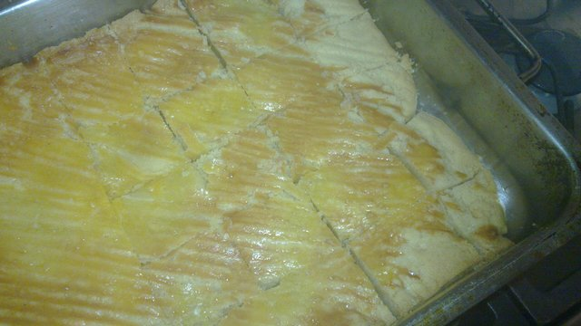
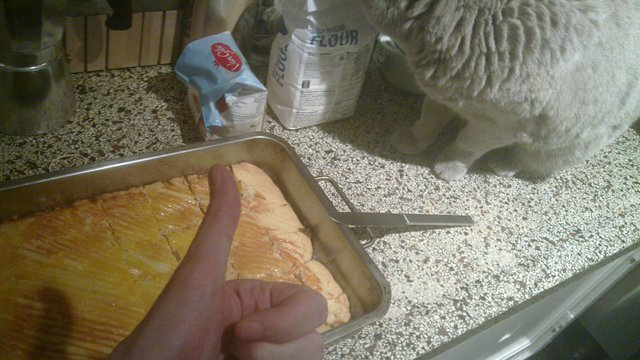

# Butter cookie (Boterkoek)
### by team aczid

```C
from cooking import *

# A really simple recipe for boterkoek (butter cookie)

# 300g butter, 300g flour, 200g of sugar, a pinch of salt and an egg
ingredients = {
    'butter': Butter(300)
    'sugar':  Sugar(200)
    'salt':   Salt(PINCH)
    'flour':  Flour(300)
    'egg':   Egg()
}

# Get a bowl and mix the butter with the sugar and a pinch of salt
bowl = Bowl()
for x in ['butter', 'sugar', 'salt']:
    bowl.add(ingredients[x])

# Make sure the kneeding arms on the mixer are inserted correctly :D
assert Mixer.direction == DOWN

while smoothness(bowl) < 100:
    bowl = Mixer.mix(bowl)

# Slowly add all the flour while mixing
bowl.add(ingredients['flour'][-1])
while smoothness(bowl) < 100:
    bowl.add(ingredients['flour'][-1])
    bowl = Mixer.mix(bowl)
    
    if len(ingredients['flour']) < 1:
        # Add more flour if it's not smoothing out well
        ingredients['flour'] += Flour(10)

# Get a baking tray with some greaseproof paper on it and spread out the mixture on it into a flat surface as one big cake
tray = BakingTray()
tray_x, tray_y = dim(tray)
try:
    tray.add(BakingSheet())
except:
    tray.add(last(ingredients['butter']))

mixture = bowl.empty()
tray.add(flatten(bowl.pop()))

fork = Fork()

# Cut some diagonal shapes into the cake
for x in range(0, tray_x, size_x):
    try:
        cut(tray[0], tray_x, tray_x, fork, depth=1)
    except:
        pass

# Crack an egg into the bowl and mix it
bowl.add(ingredients['egg'].crack())
bowl[0] = filter(lambda x: x!= EGGSHELL, bowl[0])
bowl = Mixer.mix(bowl)

# Spread the mixed egg over the cake
tray[0].spread(bowl[0])

# Preheat oven to 200C
sys.oven.set(200)

# Cool the tray while it's heating
sys.fridge.push(tray)
sleep(60*10)
tray = sys.fridge.pop(tray)

# Put the tray in the oven until it's done (about 20 minutes)
sys.oven.push(tray)
while not isgolden(tray[0]):
    sleep(60)
tray = sys.oven.pop(tray)

# Let it cool a bit
# If we would cut it up now it would disintegrate into a mess
sleep(20*60)

# Cut up the cake into individual cookie pieces
knife = Knife()
size_x, size_y = tray_x/8, tray_y/8
for x in range(0, tray_x, size_x):
    cut(cake, tray_x, 0, knife)
for y in range(0, tray_y, size_y):
    cut(cake, 0, tray_y, knife)

# Pick them off the tray
cookies = []
for cookie in tray:
    cookies.add(cookie)

# Eat all the cookies!
map(eat, cookies)

```

The baking of: [Video](baking_of.gif)



