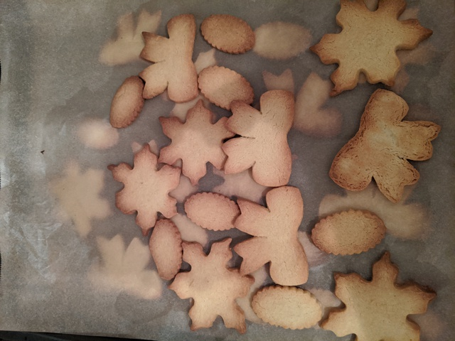
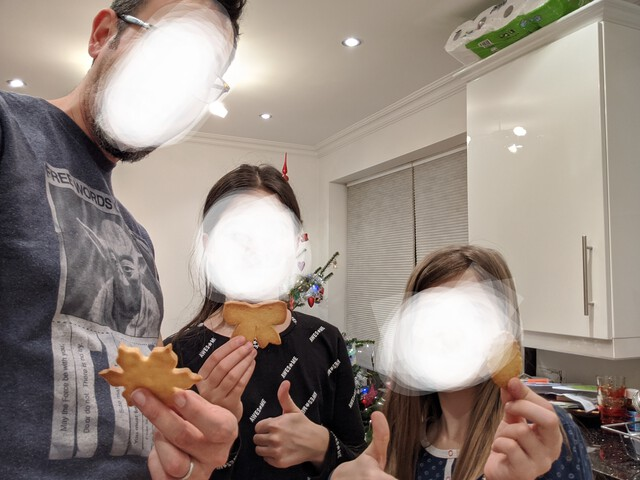

# Sables de Noël
### by team angeryreaccsonly

```C
#include <recipe_base.h>
#include <kitchen_utils.h>
#include <ingredients.h>

int main() {
	Oven *oven = allocate_oven();
	Mixer *mixer = allocate_mixer();
	Surface *workarea = allocate_surface();
	Bakingtray *tray = allocate_bakingtray(INCLUDE_BAKING_PAPER);

	preheat(oven, 177, CELSIUS);

	add_to_mixer(mixer, ingredient("room-temperature butter", 232, GRAM));
	add_to_mixer(mixer, ingredient("granulated sugar", 0.5, CUP));
  add_to_mixer(mixer, ingredient("confectioner's sugar", 0.25, CUP));
  add_to_mixer(mixer, ingredient("salt", 0.5, TEASPOON));
	mix_contents(mixer);
  add_to_mixer(mixer, ingredient("egg", 2, YOLKS));
  mix_contents(mixer);
	add_to_mixer(mixer, ingredient("vanilla extract", 2, TEASPOON));
  mix_contents(mixer);
	add_to_mixer(mixer, ingredient("flour", 2, CUP));
  mix_contents(mixer);

	spread_on_surface(workarea, get_contents(mixer));

	while(!is_empty(workarea) && !is_full(tray)) {
		move(cut_cookie_shape(workarea), tray);
	}

	move(tray, oven);

	sleep(720);

	empty_into(tray, cookiejar); // careful, may be hot

	clean(bowl);
	clean(workarea);
	clean(cooldown(tray));
	clean(cooldown(oven));

	// optional: decorate cookies

	return HAPPY;
}
```


The making of: https://youtu.be/lqYdext1Pdk



