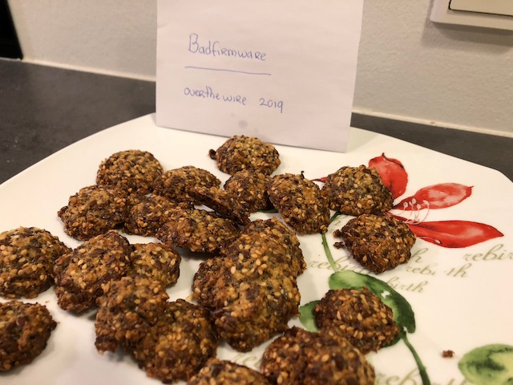
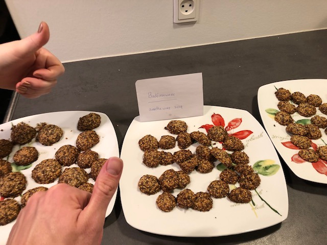

# Bonanza Chips

### by team badfirmware

```haskell
import Control.Concurrent (threadDelay)

data Person = Me | Mom

type Celcius = Float

data Heat = HotAir | Fan | Upper | Lower | UpperLower | GrillFan
data Prep = PreHeated | Cold

data Oven = Oven {
    degrees :: Celcius,
    mode    :: Heat,
    prep    :: Prep
}

data Unit n = Tablespoon n | Gram n | Deciliter n | Int n

data Ingredient = Ingredient {
    name   :: String,
    amount :: Unit Float
}

newtype Bowl = Bowl {
    ingredients :: [Ingredient]
}

newtype Tray = Tray {
    result :: [Ingredient]
}

type Dough = Ingredient
type DoughBall = Dough

minutes :: Int
minutes = 60 * 1000000

sleep :: Int -> IO ()
sleep = threadDelay

heat :: Tray -> Oven -> Int -> IO Tray
heat a o n = do
  x <- sleep n
  return a

spreadOnSurface :: [DoughBall] -> [Tray]
spreadOnSurface xs
  | not (null xs) = Tray (take n xs) : spreadOnSurface (drop n xs)
  | otherwise     = []
  where n = 12 -- unless you have a *huge*... tray

figureItOut :: a -> a
figureItOut = id -- in doubt? call mom

clean :: IO ()
clean = putStrLn "good luck!"

-- bowl operations
mix :: Bowl -> Ingredient -> Bowl
mix b i = Bowl $ i : ingredients b

mixIngredients :: [Ingredient] -> Bowl -> Bowl
mixIngredients = flip $ foldl mix

crumble :: Bowl -> Bowl
crumble = figureItOut

stir :: Bowl -> Bowl
stir = figureItOut

-- roughly same diameter as a SEK 5 krona
rollBall :: Dough -> DoughBall
rollBall = figureItOut

bake :: Oven -> Tray -> IO Tray
bake oven tray = heat tray oven (10 * minutes)

split :: Bowl -> Int -> [Dough]
split b n = replicate n $ Ingredient "cookie" $ Int 1

solve :: Person -> IO [Tray]
solve _ = mapM (bake oven) trays
 where
  trays = spreadOnSurface $ map rollBall $ split dough 50
  dough = stir bowl
  bowl  = step3 . step2 . step1 $ emptyBowl

  step1  = crumble . mixIngredients basics
  step2  = stir    . mixIngredients egg
  step3  = mixIngredients $ Ingredient "baking powder" (Tablespoon 2.0) : seeds ++ flours

  basics =
    [ Ingredient "butter"       $ Gram       150.0
    , Ingredient "sugar"        $ Gram       150.0
    ]
  seeds =
    [ Ingredient "linseeds"     $ Deciliter  1.5
    , Ingredient "sesame seeds" $ Deciliter  1.5
    , Ingredient "chia seeds"   $ Deciliter  1.0
    ]
  flours =
    [ Ingredient "oats"         $ Deciliter  2.0
    , Ingredient "wheat bran"   $ Deciliter  (3 / 4)
    , Ingredient "wheat flour"  $ Tablespoon 2.0
    ]
  oven      = Oven 200.0 Upper PreHeated
  emptyBowl = Bowl []
  egg       = [Ingredient "egg" $ Int 1]

main = do
  solve baker
  sleep coolPeriod
  -- TODO: keep baking pure: must handle "tastes delicious" side-effects
  putStrLn "done."
  clean
 where
  coolPeriod = 60 * minutes
  baker      = Me
```

The making of: [https://streamable.com/kam79](https://streamable.com/kam79)



