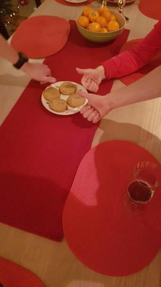

# <American Cookies>
### By Datasnokmennene

'''python
import drawer
import fridge
import time
import appliances

def mix_butter_and_sugar(butter, sugar):
    mix = appliances.mix(butter, sugar)
    mix.append(vanilla*0.05)
    mix.append(eggs*2)
    return mix

def dry_mix(flour, baking_soda, salt):
    mix = appliances.mix(flour, baking_soda, salt)
    return mix

def cut_chocolate(chocolate)
    bits = appliances.knife(chocolate)
    return bits

def main():
    # Making the dough
    dough = mix_butter_and_sugar(drawer.sugar*250, fridge.butter*250)
    dough += dry_mix(drawer.flour*500, drawer.baking_soda*0.05, drawer.salt*0.05)
    dough += cut_chocolate(drawer.chocolate*200)

    # Adding to the oven
    while dough > 0:
        for i in appliances.baking_tray:
            appliances.baking_tray.append(dough)

        appliances.oven.add(tray)
        time.sleep(600)
        cookies = appliances.oven.remove(tray)
    
    
    drawer.box.add(cookies)
    print("Cookies finished")

main()
'''

The making of: https://www.youtube.com/watch?v=38kgETqlO4w&feature=youtu.be

