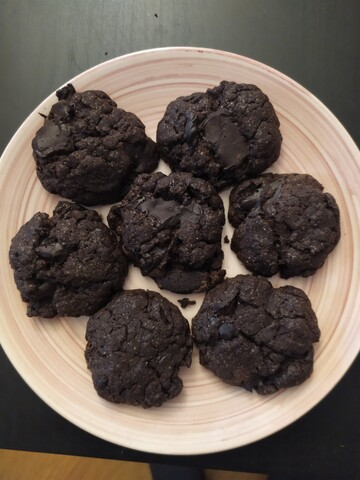
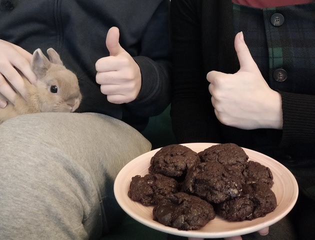

# Chocolate cookies
### by team gf128

```C
#include <recipe_base.h>
#include <kitchen_utils.h>
#include <ingredients.h>

int main() {
	Oven *oven = allocate_oven();
	Bowl *bowl = allocate_bowl();
	Pan *pan = allocate_pan();
	Surface *workarea = allocate_surface();
	Bakingtray *tray = allocate_bakingtray(INCLUDE_BAKING_PAPER);
	void * melted_chocolate;

	preheat(oven, 180, CELSIUS);

	add_to_pan(pan,ingredient("chocolate",100, GRAM):
	add_to_pan(pan,ingredient("butter",80, GRAM):
	melted_chocolate = melt(pan);
	add_to_bowl(bowl, melted_chocolate);
	add_to_bowl(bowl, ingredient("sugar", 80, GRAM));
	add_to_bowl(bowl, ingredient("egg", 1, PIECE));
	add_to_bowl(bowl, ingredient("flour", 175, GRAM));
	add_to_bowl(bowl, ingredient("baking powder", 1, TEASPOON));
	add_to_bowl(bowl, ingredient("salt", 1, PINCH)); 
	mix_contents(bowl);

	spread_on_surface(workarea, get_contents(bowl));

	while(!is_empty(workarea) && !is_full(tray)) {
		move(cut_cookie_shape(workarea), tray);
	}

	move(tray, oven);

	sleep(600);

	empty_into(tray, cookiejar); 

	clean(bowl);
	clean(workarea);
	clean(cooldown(tray));
	clean(cooldown(oven));

	return HAPPY;
}
```

The making of: https://streamable.com/cetc6



