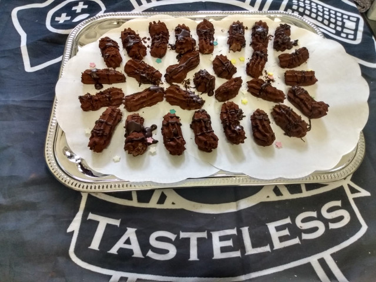
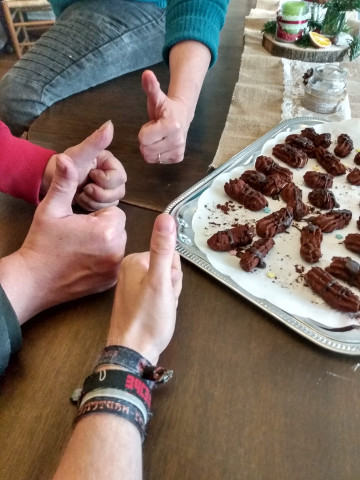

# Awful Distateful Whisky Enrichment Noted by Tasteless (ADWENT)
### by team Tasteless

```python
import time


class KitchenUtil():
    def __init__(self, name):
        self.name = name
        self.contents = []

    def add(self, indigrient):
        util = self.__class__.__name__
        print(f'Add {indigrient.quantity}{indigrient.unit} {indigrient.name} to {util} {self.name}')
        self.contents.append(indigrient)

    def get(self):
        return self.contents.pop()


class BakingPlate(KitchenUtil):
    def __init__(self, name):
        self.name = name
        self.contents = []

class Bowl(KitchenUtil):

    def __init__(self, name):
        super().__init__(name)
            
    def mix(self):
        print(f'Mix contents of bowl {self.name}')
        contents_str = 'mix of ' + '/'.join([i.name for i in self.contents]).replace('mix of ','')
        quantity = sum([i.quantity for i in self.contents])
        self.contents = [Ingredient(contents_str, quantity, base_indigrient=False)]


class PastryBag(KitchenUtil):
    def __init__(self, name, qty_per_pastry=20):
        super().__init__(name)
        self.qty_per_pastry = qty_per_pastry

    def add(self, indigrient):
        print(f'Fill {indigrient.quantity}{indigrient.unit} {indigrient.name} in pastry bag {self.name}')
        self.content = [indigrient]

    def squeeze(self, target):
        mixture = self.content.pop()
        amount = int(mixture.quantity / self.qty_per_pastry)
        target_util = target.__class__.__name__
        target.contents = [Ingredient(f'{amount} pastries', mixture.quantity) ]

        print(f'Squeeze {amount} pastries out of pastry bag {self.name} onto {target_util} {target.name}')

class Refridgerator(KitchenUtil):
    def __init__(self, name, qty_per_pastry=20):
        super().__init__(name)

    def add(self, thing):
        print(f'Put {thing.__class__.__name__} {thing.name} into refridgerator {self.name}')


class Ingredient():
    def __init__(self, name, quantity, unit='g', base_indigrient=True):
        self.name = name
        self.quantity = quantity
        self.unit = unit
        if base_indigrient:
            print(f'{self.quantity:5}{self.unit} {self.name}')

    def split(self, amount):
        print(f'Split {self.name} into {self.quantity-amount}{self.unit} and {amount}{self.unit}')
        self.quantity -= amount
        return Ingredient(self.name, amount, self.unit, base_indigrient=False)


    def melt(self):
        print(f'Melt {self.name}')
        self.name = f'melted {self.name}'


    def crunch(self):
        print(f'Crunch {self.name}')
        self.name = f'crunched {self.name}'

    def refine_with(self, indigrient):
        print(f'Refine {self.name} with {indigrient.name}')
        self.name = f'{self.name} refined with {indigrient.name}'


def bake_adwent(multi):

    print("\n*** Ingredient: ***\n")

    cocoa = Ingredient('cocoa powder', 30 * multi)
    sugar = Ingredient('powdered sugar', 60 * multi)
    biscuits = Ingredient('ladyfingers', 100 * multi)
    butter = Ingredient('butter', 120 * multi)
    chocolate = Ingredient('bittersweet chocolate', 200)
    whisky = Ingredient('whisky', 50 * multi)

    print("\n*** Instructions: ***\n")

    bowl_1 = Bowl(1)
    bowl_2 = Bowl(2)
    pastry_bag = PastryBag(1)
    baking_plate = BakingPlate(1)
    fridge = Refridgerator(1)
    
    chocolate.melt()
    biscuits.crunch()

    print()

    bowl_1.add(butter)
    bowl_1.add(sugar)
    bowl_1.mix()

    print()

    bowl_2.add(biscuits)
    bowl_2.add(whisky)
    bowl_2.mix()

    print()

    chocolate_2 = chocolate.split( int(chocolate.quantity/4) )
    bowl_1.add(chocolate)
    bowl_1.add(bowl_2.get())
    bowl_1.mix()

    print()

    pastry_bag.add(bowl_1.get())
    pastry_bag.squeeze(baking_plate)

    print()

    fridge.add(baking_plate)

    time.sleep(60 * 10)

    print()

    pastries = baking_plate.get()
    pastries.refine_with(cocoa)
    pastries.refine_with(chocolate_2)

    print("\n*** Finished! ***\n")

if __name__ == '__main__':
    bake_adwent(1)
```

The making of: https://www.youtube.com/watch?v=vxkdRG6-IhU



